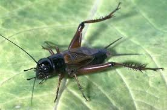
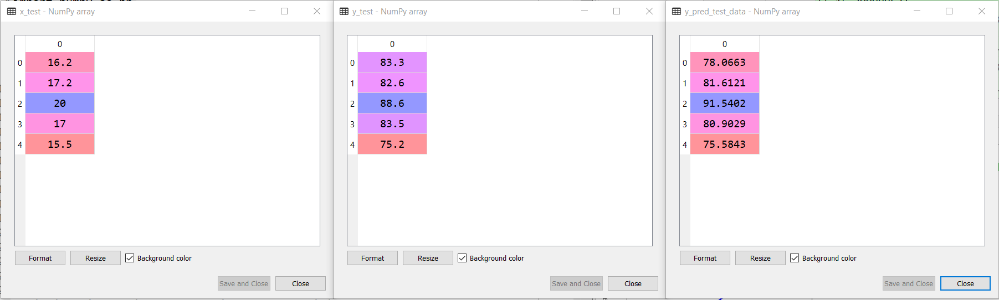
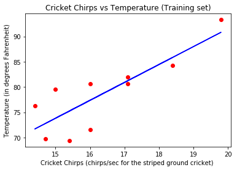
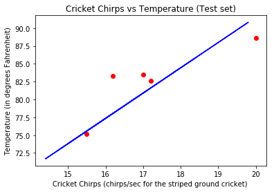

# Cricket Chirps Vs Temprature Simple Linear regression

In this project I we use the Cricket Chirps Vs Temprature data create a Simple Linear Regression model and test how well will the model predict the Temprature on given Cricket Chirps :sunglasses:  
This is a Cricket Insect :cold_sweat:    

### Prerequisites

Download and Install Anaconda https://www.anaconda.com/ 
Spyder 3.3.4  
Python 3.6 
Libraries required in python are numpy, matplotlib.pyplot, pandas please download it before importing

### Results 

Based on the Cricket Chirps given temprature  and the temprature predicted by our model are compared.:white_check_mark: 
Cricket Chirps (x_test) at left  
Given Test Temprature (y_test)in middle  
Predicted Temprature  (y_pred_test_data) at right    

The model created in the given code was given the data of training set and the data visualization graph is below :white_check_mark:

The model then  was given the data of test set and the data visualization graph is below :white_check_mark:

### I have put comments for better coder readability if any queries please feel free to email me :thumbsup:
